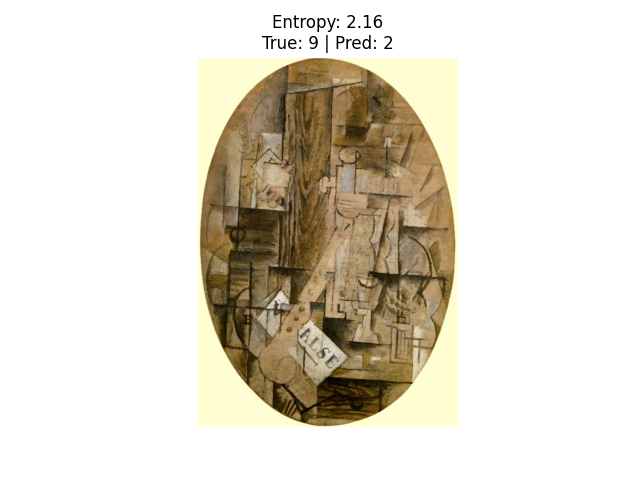

# Convolutional-Recurrent-Architectures
# WikiArt Classification Project

A deep learning pipeline for classifying paintings by **Artist**, **Style**, and **Genre** using the [WikiArt dataset](https://github.com/cs-chan/ArtGAN/blob/master/WikiArt%20Dataset/README.md). This project supports:

- CNN + RNN (ResNet + LSTM) hybrid model
- Transfer learning across tasks (e.g., Artist → Genre)
- Full training logs, visualizations, and evaluation metrics
- Outlier detection via prediction uncertainty (entropy)

---
## Model Architectures

### 🔹 ResNet + LSTM (ResNetLSTM)
- ResNet50 backbone (pretrained)
- Feature sequence passed to LSTM for temporal/context modeling

---

## Training

Run training for a specific task:
```bash
python train.py        # For artist classification
python train_finetune.py --task genre --file Genre  # Finetune for genre/style
```

Key features:
- Early stopping with patience
- Learning curve + accuracy plot saved to `checkpoints/`
- Best model saved as `checkpoints/<task>_best_model.pt`

---

## Evaluation

Includes metrics:
- Accuracy, Precision, Recall, F1-score
- Confusion matrix (png)
- Class-wise performance breakdown

```bash
python evaluate_metrics.py --task artist
```

---

## Outlier Detection (Uncertainty Analysis)

Detects low-confidence predictions using **entropy**:
```bash
python analyze_uncertainty.ipynb --task genre
```

Output:
- Top-N most uncertain predictions saved in `/outliers`
- Class-wise summary of error and uncertainty rate

---

## Outputs

### Artist Classification
- 🔹 Training Curve
  
- 🔹 Confusion Matrix
  
- 🔹 Classsification Report
  
- 🔹 Outlier Sample Paint
<div style="display: flex; gap: 10px;">
  
  
  
  
  
</div>

### Genre Classification
- 🔹 Training Curve
  
- 🔹 Confusion Matrix
  
- 🔹 Classsification Report
  
- 🔹 Outlier Sample Paint
<div style="display: flex; gap: 10px;">
  
  
  
  
  
</div>

### Style Classification
- 🔹 Training Curve
  
- 🔹 Confusion Matrix
  
- 🔹 Classsification Report
  
- 🔹 Outlier paint
<div style="display: flex; gap: 10px;">
  
  
  
  
  
</div>

### Observation: Style Label Imbalance

During my experiments, I noticed that the style classification task is significantly imbalanced. Some styles, such as Impressionism and Realism, are heavily represented in the dataset, while others like Suprematism or Symbolism appear far less frequently. This imbalance can negatively impact the model’s ability to generalize, especially for underrepresented styles.

---

## Jupyter Notebook (Demo)

A ready-to-run notebook (`notebooks/Artist_training_demo.ipynb`) is provided to:
- Visualize training curves
- Show confusion matrix
- Display prediction examples and uncertainties

---

## Acknowledgements
- Dataset: [WikiArt Dataset (ArtGAN)](https://github.com/cs-chan/ArtGAN)
- Base model: ResNet50 pretrained on ImageNet
---